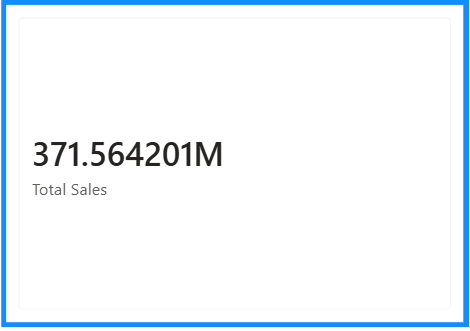
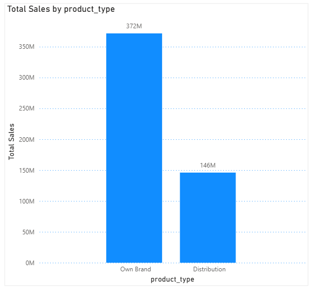
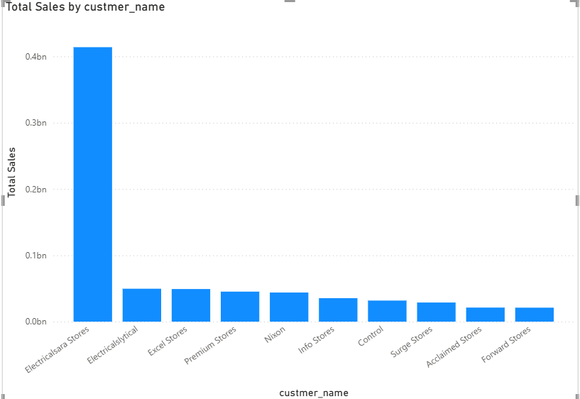

# Sales & Customer Insights Analysis (2017–2020)

## Overview
This project analyzes sales, market, product, and customer performance using SQL.

## Tools Used
- MySQL
- MySQL Workbench

## Key Analyses
- Time-based sales trends
- Market-wise revenue contribution
- Product performance and revenue per unit
- Customer segmentation and top customers analysis

## Files
- `analysis_queries.sql` – All SQL queries used for analysis

## Power BI Dashboard

The Power BI dashboard was built to analyze sales and customer performance across
multiple dimensions and includes:

- Key KPIs: Revenue, Sales Quantity, Profit
- Year-wise and month-wise sales trends
- Market and product performance
- Top customers by revenue contribution

### Dashboard Screenshots

**Overall Overview**

**Sales Trend Analysis**

**Market & Product Performance**

**Top Customers**

